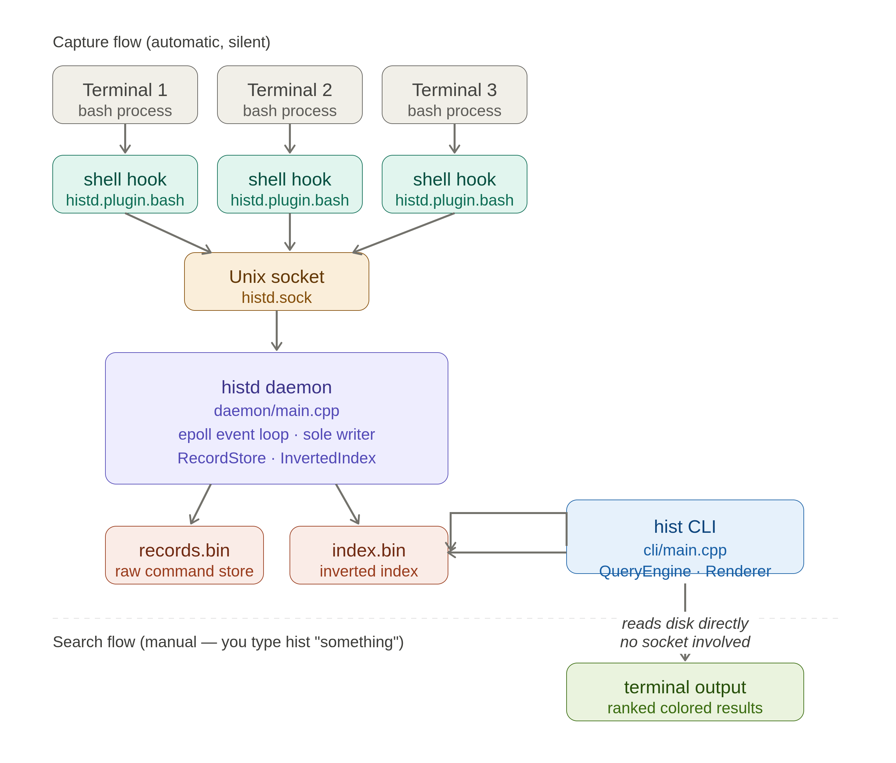

# histd — Smart Terminal History Engine

A shell history tool that actually lets you search. Every command you run is captured with its exit code, duration, working directory, and timestamp — then indexed for instant, ranked full-text search from any terminal.

Bash's built-in history is a flat text file with no structure: no search, no filtering, no way to see which commands keep failing. `histd` fixes that with a background daemon, a custom binary storage engine, and a memory-mapped inverted index — the same class of techniques used by real search engines and databases, built from scratch in C++.

## Features

- **Full-text search** over your entire command history, ranked by TF-IDF relevance and recency
- **Failure clustering** — surfaces commands that keep failing, grouped and counted, so you can see patterns instead of scrolling through history one line at a time
- **Filters** — by exit code (`--failed`), time range (`--since 7d`), or working directory (`--project`)
- **Fast** — search resolves in ~20ms even at 10,000+ records, via a memory-mapped on-disk index with O(log N) lookup (see [BENCHMARKS.md](BENCHMARKS.md))
- **Zero shell lag** — the capture hook is fire-and-forget; typing feels exactly the same as without it

## How it works

```
shell hook (bash-preexec based)
      │  captures cmd, cwd, exit code, duration, timestamp
      │  fire-and-forget over a Unix domain socket
      ▼
histd daemon (background process)
      │  appends to records.bin (custom binary format)
      │  maintains an in-memory inverted index
      │  periodically persists the index to index.bin (mmap-ready binary format)
      ▼
hist CLI
      │  memory-maps index.bin, binary-searches the term directory
      │  falls back to a full rebuild only if the index is stale
      ▼
ranked, colored results in your terminal
```

See [DESIGN.md](DESIGN.md) for the full architectural writeup — binary format design, why mmap over buffered I/O, why no mutex is needed, and the trade-offs behind the on-disk index format.



## Install

```bash
# 1. Clone and build
git clone https://github.com/<you>/histd
cd histd
mkdir build && cd build
cmake .. -DCMAKE_BUILD_TYPE=Release
make

# 2. Add the shell hook to your .bashrc
echo 'source ~/histd/shell/histd.plugin.bash' >> ~/.bashrc
source ~/.bashrc

# 3. Start the daemon
~/histd/build/histd
```

That's it — no manual directory creation, no config files to edit. The hook downloads its one dependency (`bash-preexec`) and creates its config directory automatically on first run; the daemon creates its data directory automatically on first start.

To run `hist`/`histd` from any directory without the full path, add the build directory to your `PATH`:

```bash
echo 'export PATH="$PATH:$HOME/histd/build"' >> ~/.bashrc
```

## Usage

```bash
# search your history
hist search "docker"

# only show commands that failed
hist search "docker" --failed

# only show commands from the last 7 days
hist search "deploy" --since 7d

# only show commands run from a specific directory
hist search "npm" --project ~/myapp

# see which commands keep failing
hist failures

# check index stats
hist status
```

## Project structure

```
histd/
├── daemon/          the background daemon (Unix socket + epoll event loop)
├── cli/             the hist search CLI
├── src/
│   ├── record.hpp          on-disk record layout + FNV-1a hash
│   ├── record_store.*      binary storage engine (pwrite + mmap)
│   ├── tokenizer.*          command → searchable token pipeline
│   ├── inverted_index.*    in-memory TF-IDF index + two-pointer intersection
│   ├── index_store.*       persistent mmap index format (serializer + reader)
│   ├── query_engine.*      search orchestration + filters
│   ├── failure_clusterer.* repeated-failure detection
│   └── renderer.hpp         colored terminal output
├── shell/           the bash-preexec based capture hook
└── tests/           unit and integration tests for each component
```

## Performance

| Records | Fast path (mmap index) | Fallback (full rebuild) |
|---------|--------------------------|----------------------------|
| 1,000   | ~10-20ms                 | ~70-90ms                    |
| 10,000  | ~20ms                    | ~500-560ms                  |

Full methodology and additional numbers (memory footprint, shell hook overhead) in [BENCHMARKS.md](BENCHMARKS.md).

## What's not here (yet)

Documented honestly in [DESIGN.md](DESIGN.md#future-enhancements): a daemon-served query protocol (so the CLI always reads the daemon's live index instead of a possibly slightly-stale on-disk snapshot), segment-based incremental indexing, and semantic search. These were deliberately scoped out to ship a complete, correct, well-tested v1 first.
